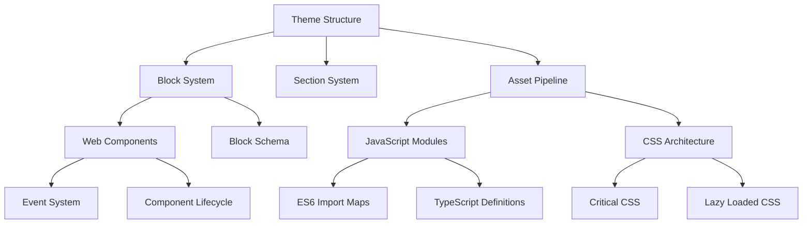

# 🧩 System Patterns - KPR Theme

## 🏗️ Kiến Trúc Tổng Quan

KPR Theme được xây dựng dựa trên kiến trúc component-based hiện đại, lấy cảm hứng từ Horizon Theme với những cải tiến quan trọng. Dưới đây là tổng quan về kiến trúc hệ thống:



## 📦 Core Architecture Patterns

### 1. Block System
Trung tâm của KPR Theme là **Block System** - một cách tiếp cận component-based cách mạng:

- **Component Block Prefixing**: Blocks với prefix `_` là internal components
- **Standalone Blocks**: Blocks không có prefix có thể được sử dụng độc lập
- **Block Composition**: Blocks phức tạp được tạo bằng cách kết hợp nhiều blocks đơn giản
- **Block Schema**: Mỗi block có schema riêng với settings, presets, và limits

```liquid

```

### 2. Web Component Architecture
KPR Theme sử dụng **Custom Elements** làm nền tảng cho JavaScript architecture:

- **Component Base Class**: Tất cả components kế thừa từ base `Component` class
- **Lifecycle Hooks**: `connectedCallback`, `disconnectedCallback` cho component lifecycle
- **Component Registry**: Automatic registration và instantiation
- **Event Delegation**: Sử dụng event delegation thay vì declarative events

```javascript
class KprHero extends Component {
  // Component declaration
  requiredRefs = ['title', 'subtitle'];
  
  connectedCallback() {
    super.connectedCallback();
    // Initialization code
  }
  
  // Event handling with delegation
  handleClick = (event) => {
    const target = event.target instanceof Element ? event.target : null;
    const button = target ? target.closest('[data-selector]') : null;
    
    if (button && button instanceof HTMLElement) {
      // Handle event
    }
  };
}

customElements.define('kpr-hero-section', KprHero);
```

### 3. Section Composition
Sections được xây dựng theo pattern composable:

- **Universal Section Wrapper**: `sections/_blocks.liquid` làm container chung
- **Section Customization**: Sections expose settings cho layout và appearance
- **Block Aggregation**: Sections collect và render multiple blocks
- **Content Projection**: Sections provide content slots cho dynamic layouts

```liquid

    
   Thu thập tất cả blocks được add trong theme editor 



```

## 🔄 Data Flow Patterns

### 1. Props Down, Events Up
KPR Theme tuân theo data flow một chiều:

- **Props Down**: Data được truyền xuống từ sections đến blocks thông qua props
- **Events Up**: Components emit events để communicate upward
- **Global Event Bus**: Document-level events cho cross-component communication
- **State Management**: Minimal global state, chủ yếu là component-level state

### 2. Settings Cascade
Settings được truyền qua multi-level cascade:

- **Theme Settings**: Global settings từ `settings_data.json`
- **Section Settings**: Section-specific settings
- **Block Settings**: Individual block settings
- **Default Fallbacks**: Hierarchical fallback system cho missing values

## 📱 Responsive Patterns

### 1. Mobile-First Design
- **Responsive CSS Variables**: `--desktop-value` và `--mobile-value` pairs
- **Container Queries**: Layout based on container size, không phải viewport
- **Adaptive Components**: Components tự điều chỉnh theo available space
- **Responsive Images**: `srcset` và `sizes` cho optimized image loading

### 2. Layout Composition
- **Flexible Grids**: CSS Grid và Flexbox cho advanced layouts
- **Stack & Inline Components**: Components follow compositional layout patterns
- **Spacing System**: Consistent spacing tokens và variables
- **Content Modifiers**: Modifiers cho alignment, stacking và reordering

## 🔌 Component Initialization Pattern

### 1. Component Registration
Để đảm bảo component hoạt động đúng, cần thực hiện đầy đủ các bước sau:

- **Import Maps Registration**: Đăng ký component trong import maps
```liquid
<script type="importmap">
  {
    "imports": {
      "@theme/your-component": "{{ 'your-component.js' | asset_url }}"
    }
  }
</script>
```

- **Module Preloading**: Thêm modulepreload link để tối ưu loading
```liquid
<link
  rel="modulepreload"
  href="{{ 'your-component.js' | asset_url }}"
  fetchpriority="low"
>
```

- **Script Loading**: Thêm script tag để load module
```liquid
<script
  src="{{ 'your-component.js' | asset_url }}"
  type="module"
  fetchpriority="low"
></script>
```

- **Custom Element Definition**: Đăng ký custom element sau khi định nghĩa class
```javascript
customElements.define('your-component-name', YourComponent);
```

### 2. Component Event Handling
KPR Theme sử dụng event delegation thay vì declarative event syntax:

- **Standard Event Delegation**:
```javascript
connectedCallback() {
  super.connectedCallback();
  this.addEventListener('click', this.handleClick);
}

handleClick = (event) => {
  const target = event.target instanceof Element ? event.target : null;
  const button = target ? target.closest('[data-action="specific-action"]') : null;
  
  if (button && button instanceof HTMLElement) {
    // Handle the event
    const data = button.dataset.someData || '';
    this.processAction(data);
  }
};
```

- **Communicating Between Components**: Sử dụng custom events trên document level
```javascript
// Component A: Dispatch event
document.dispatchEvent(new CustomEvent('kpr:event-name', {
  bubbles: true,
  detail: { data: value }
}));

// Component B: Listen for event
document.addEventListener('kpr:event-name', (event) => {
  const { data } = event.detail;
  // Handle event
});
```

### 3. Component Markup Pattern
Cấu trúc HTML cho custom elements cần tuân thủ các quy tắc:

- **Custom Element Tag**: Sử dụng kebab-case với section name
```html
<kpr-hero-section
  data-section-id="{{ section.id }}"
  data-section-type="kpr-hero"
  class="kpr-hero-section"
>
  <!-- Content -->
</kpr-hero-section>
```

- **Action Attributes**: Sử dụng data-action để đánh dấu element có thể tương tác
```html
<button 
  class="concept-button" 
  data-concept="traditional"
  data-action="show-concept"
>
  {{ section.settings.btn_traditional }}
</button>
```

## 🛠️ Technical Design Patterns

### 1. Performance Optimization
- **Critical Path Rendering**: Inline critical CSS
- **Component Lazy Loading**: Load components when needed
- **Resource Prioritization**: Proper `preload`, `prefetch`, và `defer`
- **View Transitions**: Smooth page transitions với minimal reflow

### 2. Progressive Enhancement
- **Core Functionality First**: Đảm bảo functionality cơ bản không cần JavaScript
- **Feature Detection**: Check browser support trước khi sử dụng advanced features
- **Fallbacks**: Graceful degradation cho older browsers
- **Accessibility**: ARIA attributes và keyboard navigation built-in

## 🧪 Testing Patterns
- **Component Testing**: Isolated component testing
- **Visual Regression**: Screenshot comparison testing
- **Performance Testing**: Lighthouse scores và Core Web Vitals
- **Accessibility Testing**: Automated và manual a11y testing

## 📏 Naming Conventions
- **Block Names**: Kebab-case (e.g., `product-card.liquid`)
- **Component Blocks**: Prefix with underscore (e.g., `_heading.liquid`) 
- **JavaScript Classes**: PascalCase (e.g., `KprHero`)
- **CSS Classes**: BEM methodology với component namespace
- **Custom Events**: Namespace events với prefix (e.g., `kpr:event-name`) 